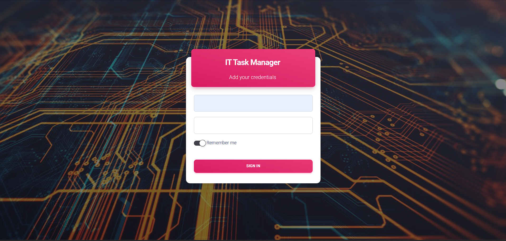
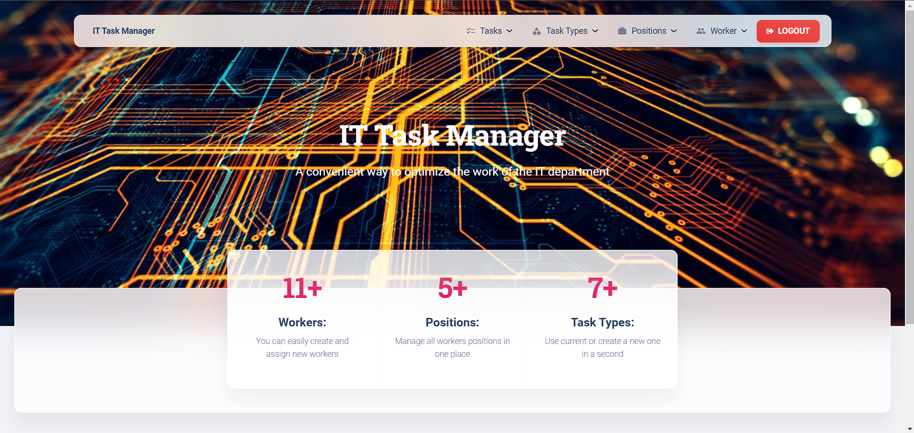
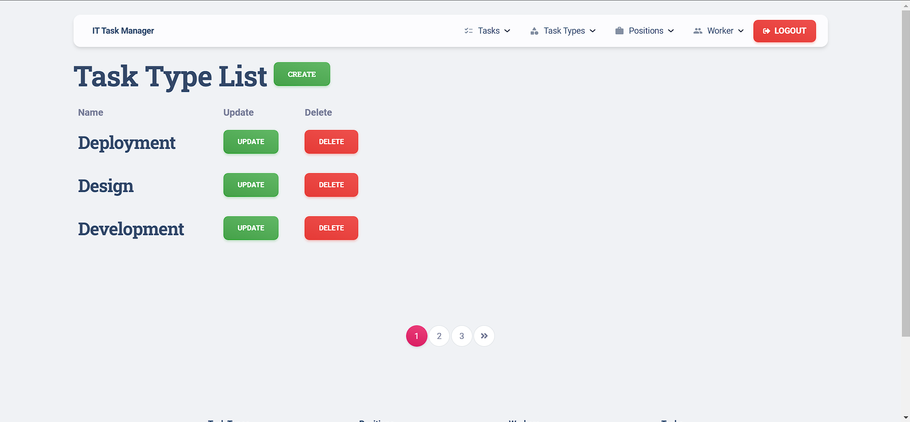
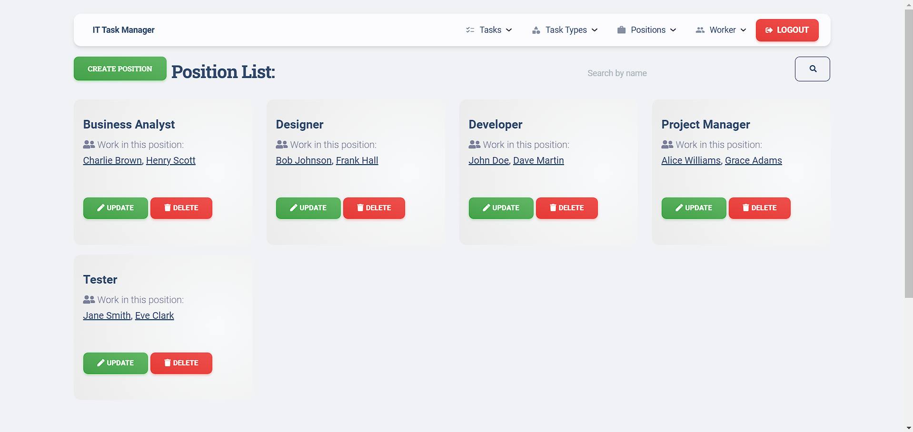
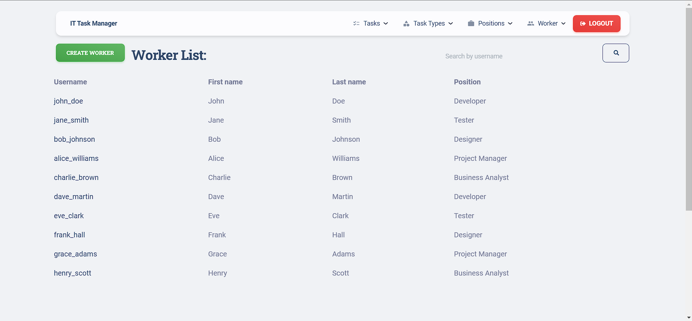

# IT_Company_Task_Manager


This Task Management System, built with Django, is designed to enhance the organization of employees, teams, projects, and tasks within an IT company. It facilitates efficient task assignment, monitoring, and management across teams and projects, ensuring clear communication and streamlined progress tracking.

## Check it out!
IT Company Task Manager project deployed on Render.

## Installation

Make sure Python3 is installed before proceeding.

1. Clone the repository:
    ```bash
    git clone https://github.com/Stekloduv/IT_Company_Task_Manager.git
    cd it-company-task-manager
    ```

2. Set up a virtual environment and activate it:

    - On macOS:
      ```bash
      python3 -m venv venv
      source venv/bin/activate
      ```

    - On Windows:
      ```bash
      python3 -m venv venv
      venv\Scripts\activate
      ```

3. Install dependencies:
    ```bash
    pip install -r requirements.txt
    ```

4. You’re now ready to start the server:
    ```bash
    python manage.py runserver
    ```

## Test User

- **Login**: `admin`  
- **Password**: `123123`

## Features

- **Authentication**: User/Worker authentication system.
- **Management**: Manage workers, projects, tasks, positions, and task types directly through the web interface.
- **Search functionality**: Custom forms enable users to search workers by username, teams and projects by name, and tasks by priority for quick access.
- **Personalized views**: Workers can view tasks assigned to them on the "Tasks" page
- **Home Page**: Users can view the number of workers, positions, and task types currently created at their company on the application's main page.

## Models

The system includes the following core models:

- **Worker**: Represents a company employee
- **Task**: An individual work item assigned to one or more workers within a project, with customizable priorities and statuses.
- **Position**: Defines the role of a worker in the company (e.g., Developer, Manager, Tester).
- **Task Type**: Categorizes tasks (e.g., Development, Testing, Design) to ensure clear task classification.

## Login



## Home




## Tasks


## Task Types




## Positions




## Workers


